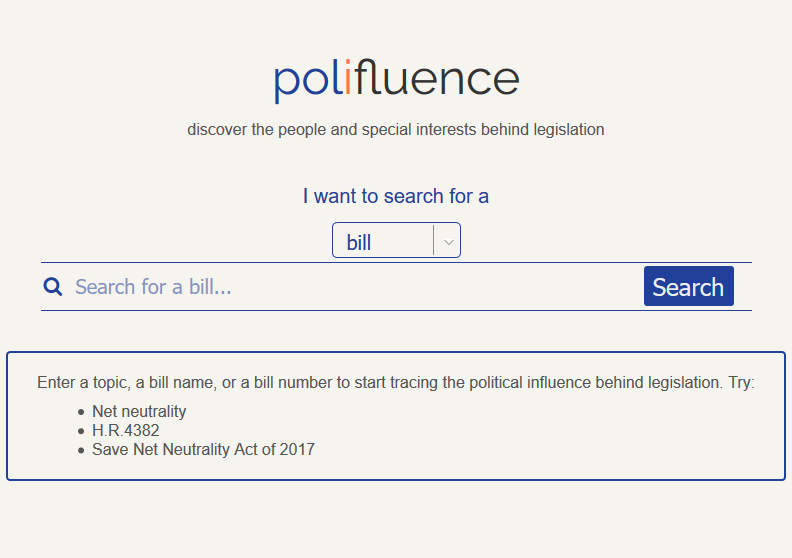
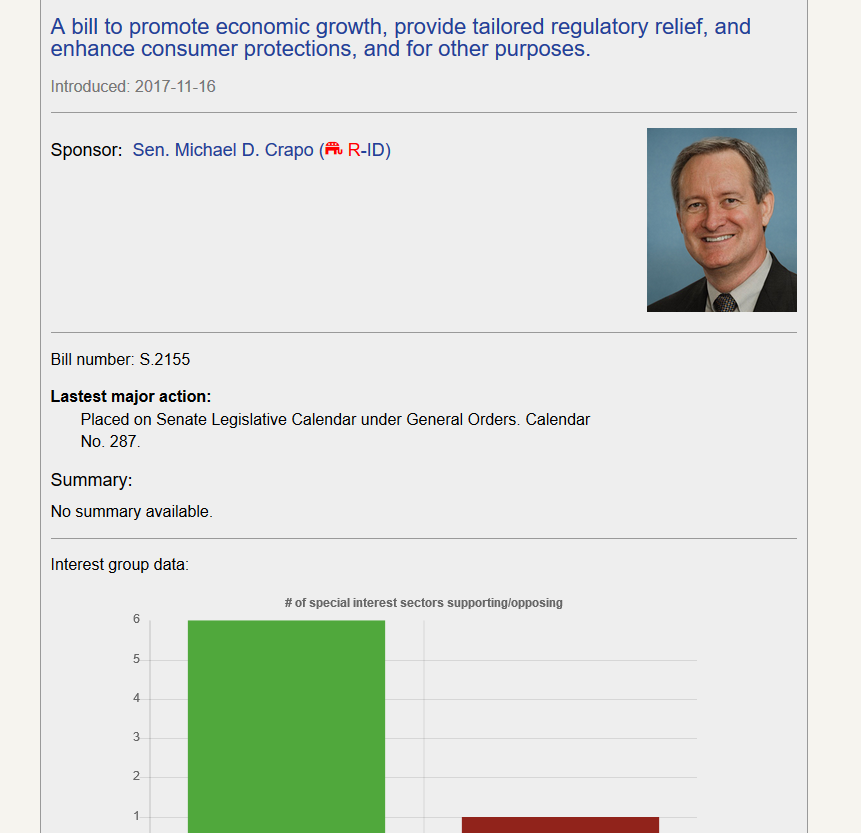

# polifluence

polifluence
============
https://mattgif.github.io/polifluence/ 

Summary
-------

polifluence combines ProPublica's congress and member APIs with MapLight special interest data
to show the influence behind legislation.

You can search for a bill to find its sponsor and charts showing which special interest groups have lobbied for and against it. You can search for a legislator to find bills they've sponsored, their voting record, and charts showing how frequently they vote across party lines.

Technology
----------
* HTML
* CSS
* JavaScript
* jQuery
* Handlebars

APIs
----
* [ProPublica](https://projects.propublica.org/api-docs/congress-api/)
* [Maplight](https://maplight.org/)
